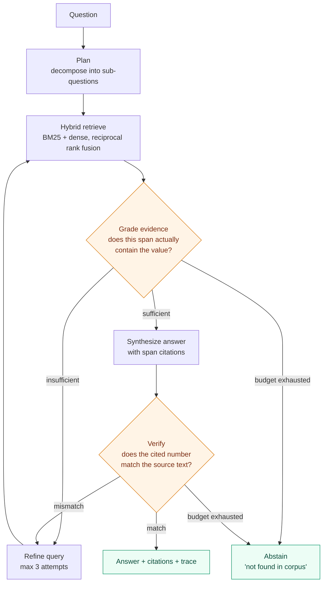

# agentic-rag-eval

**An agentic RAG system that answers numeric questions over SEC 10-K filings, benchmarked head-to-head against a non-agentic baseline on a fixed, version-pinned evaluation set.**

[](https://github.com/ingyukoh/agentic-rag-eval/actions/workflows/ci.yml)
[](LICENSE)
[](https://www.python.org/)

> **Status: v0.1 in progress.** Implemented today: the frozen-eval-set integrity gate, the
> container and benchmark entry point, the test suite, and CI. Pending: corpus ingestion,
> retrieval, the baseline, the agent, and therefore every number. The results table below is
> empty because the benchmark has not been run, and this repository does not publish figures
> it has not measured. [PLAN.md](PLAN.md) gives the build sequence and the reasoning behind
> each step; [FAILURES.md](FAILURES.md) gives the failure taxonomy the harness classifies into.

---

## Why numeric questions over 10-K filings

Most RAG demos are graded by another language model deciding whether an answer "seems
grounded." That is not a measurement — it is an opinion with a temperature setting.

This project deliberately picks a domain where **correctness is decidable**. A question
like *"What was Apple's total net sales in fiscal 2023?"* has exactly one right answer,
it appears verbatim in a public-domain document, and a wrong answer is wrong by an amount
you can compute. That choice makes every number in the benchmark table falsifiable by
anyone who clones the repo.

SEC filings are also genuinely hard for retrieval: documents run to hundreds of pages,
the important values live in tables rather than prose, and the same label ("net sales",
"revenue", "total revenues") refers to different line items across companies and years.

---

## Architecture



The **baseline** is the same retrieval layer with the loop removed: retrieve once, answer
once, no grading, no verification, no abstention. Both paths share the identical index,
the identical corpus, and the identical model — so any difference in the results table is
attributable to the agentic control flow and nothing else.

That controlled comparison is the whole point. Shipping an agent is easy; demonstrating
that the agent earns its extra latency and token cost is the engineering claim.

---

## Reproducing the benchmark

```bash
docker compose up --build bench
```

One command, **no API key required**. The command runs today — it verifies the frozen eval
set and reports the run configuration. Once the benchmark itself lands, all model calls are
served from recorded response cassettes committed to this repository, so the run stays
deterministic and free: byte-identical numbers to the ones published here, on your machine,
offline.

Every run starts by checking the evaluation set against its committed hash and aborts on
mismatch, so results can never be quietly measured against edited questions.

To run against live model APIs instead (re-recording the cassettes):

```bash
export ANTHROPIC_API_KEY=...
docker compose run --rm bench --live --record
```

---

## Results

*Not yet published — the benchmark has not been run. This section will contain the
agentic-vs-baseline table across exact-match accuracy, abstention rate on unanswerable
questions, p50/p95 latency, and cost per question.*

The evaluation set is fixed and content-hashed before any results are produced, so the
questions cannot be tuned after seeing scores. See [`data/questions/`](data/questions/).

---

## What I built, and what I didn't

**Built by me (Ingyu Koh):** the agentic control flow and its state machine, the evidence
grading and numeric verification steps, the abstention policy and retry budgets, the
hybrid retrieval fusion, the evaluation harness and metrics, the cassette record/replay
layer that makes runs reproducible offline, the failure taxonomy, the container setup,
and the test suite.

**Not mine:** the language models themselves, the embedding model, LangGraph, the BM25 and
vector index implementations, and the filings — all vendored dependencies or public-domain
source data, listed in [`pyproject.toml`](pyproject.toml) and [`docs/CORPUS.md`](docs/CORPUS.md).

This is a portfolio system built to demonstrate current engineering practice. It has not
been deployed for a client.

---

## License

MIT — see [LICENSE](LICENSE). SEC filings are public-domain U.S. government documents.
