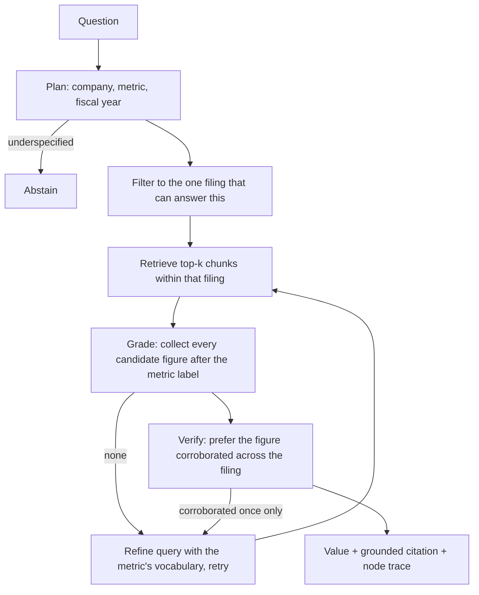

# SEC Filing RAG Auditor

**A retrieval system that answers numeric questions from real 10-K filings, measured against three controls — including one built to prove the benchmark itself is honest.**

[](LICENSE)
[](pyproject.toml)

Corpus: **12 real 10-K filings** (Apple, Microsoft, Alphabet, FY2022–FY2025) pulled from
SEC EDGAR and pinned by accession number — **3,872 chunks, ~3.9M characters**. Ground truth
comes from SEC's own XBRL company facts, so the answers are derived, not hand-written.
**Answering systems never see that fact table.** They get the question and the filing text.

## Measured result

| System | | Answered | Task success | Value accuracy | Grounded citation |
|---|---|---:|---:|---:|---:|
| `fact_lookup_oracle` | control: reads ground truth, never opens a filing | 60/64 | 6.2% | 100.0% | 0.0% |
| `naive_top1` | naive stub | 25/64 | 4.7% | 4.7% | 100.0% |
| `bm25_topk_extract` | strong baseline | 34/64 | 12.5% | 12.5% | 100.0% |
| **`agentic_verified`** | **agentic path** | **56/64** | **57.8%** | **57.8%** | **100.0%** |

Regenerate with `python -m agentic_rag_eval.bench`. Full output:
[`results/benchmark.md`](results/benchmark.md) · [per-case JSON](results/benchmark.json) ·
[every failure](results/failures.md).

**57.8% is the honest number.** The remaining 42% is characterized below rather than
hidden, and the benchmark is designed so that no system can reach 100% by being trivial.

## Why there is a fourth system in that table

An earlier version of this repository reported **100.0%** for the agentic path against a
65.6% baseline. Those numbers were reproducible, and they were meaningless.

The corpus was 60 XBRL facts uniquely keyed by (company, metric, fiscal year), and every
question named exactly those three fields. Question and fact were in bijection. To prove it,
I replaced the entire agent — LangGraph graph, evidence grading, provenance verification,
retry loop — with a **ten-line dictionary lookup**. It also scored 100.0% on all four metrics.

A benchmark that cannot separate a real system from a ten-line stub measures nothing. So the
task was rebuilt on actual filing documents, and that stub was kept permanently in the table
as `fact_lookup_oracle`. It still knows every correct value — 100% value accuracy — but it
scores **6.2%**, because a citation now only counts when the cited chunk really contains the
reported figure. It never opens a filing, so it can never ground one.

[`tests/test_discriminative.py`](tests/test_discriminative.py) asserts these properties of the
*measurement* in the local test suite: no system may saturate the benchmark, the naive, baseline and
agentic paths must land on distinct scores, and a ground-truth lookup must not pass as
grounded retrieval.

## What the agent does that the baseline does not

All four systems share one corpus and one BM25 retriever, so score differences are
attributable to control flow alone.



Two steps carry most of the gain. **Planning to a document filter**: asked for Apple's FY2022
net sales, the strong baseline returns `383,285` — Apple's FY2023 figure, read out of the wrong
year's filing. **Corroboration**: a genuine statement total is restated across the income
statement, MD&A and segment notes, while a segment row usually appears once, so candidates are
ranked by how many chunks in the filing repeat them.

## Failure analysis

Generated by the harness, not written by hand — [`results/failures.md`](results/failures.md).

| Category | `bm25_topk_extract` | `agentic_verified` |
|---|---:|---:|
| `over-abstention` | 29 | 4 |
| `segment-or-subtotal-row` | 17 | 8 |
| `wrong-column` | 1 | 15 |
| `wrong-entity` | 5 | 0 |
| `wrong-year-document` | 1 | 0 |
| `answered-unanswerable` | **3** | **0** |

Two things worth reading carefully. The agent **never answers an unanswerable question**; the
baseline does three times — and in finance a confidently wrong figure costs more than "not
found." And the agent's `wrong-column` count is *higher* than the baseline's, because it
answers far more often: its dominant remaining defect is reading a prior-year comparative from
the correct row of the correct filing. That is the next thing to fix, and it is stated here
rather than smoothed over.

## Reproduce

```bash
docker compose up --build bench
```

No API key, no network. Every input is content-hashed in
[`data/manifest.json`](data/manifest.json) and verified before the benchmark runs — if the
corpus, questions or provenance change, the run aborts instead of quietly reporting numbers
measured against something else.

Re-fetch the filings from EDGAR (requires network, respects SEC's rate limit and User-Agent
policy): `python scripts/fetch_filings.py`.

## Honest boundaries

- **No language model is called anywhere in this benchmark.** Every system is deterministic:
  the planner is a parser, the retriever is BM25, the verifier is corroboration counting.
  "Agentic" here means an explicit plan → retrieve → grade → verify → abstain control flow
  with retries and a trace, not an LLM policy. An LLM path is the next milestone.
- Three issuers, four fiscal years, five metrics. Narrow by construction.
- Latency is local control-flow time and is not comparable to a hosted-model system.
- This is a portfolio system. It has not been deployed for a client.

## What I built, and what I didn't

**Mine:** the document ingestion and chunking, the BM25 implementation, the extraction and
column-disambiguation logic, the corroboration verifier, the abstention policy, the agentic
control flow, the evaluation harness and its failure taxonomy, the discriminative-power probe
that invalidated the previous benchmark, the frozen-evidence integrity gate, the container and tests.

**Not mine:** the filings (public-domain SEC records), the XBRL facts API, LangGraph, and the
Python standard library.

## License

MIT — see [LICENSE](LICENSE).
