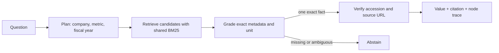

# SEC Filing RAG Auditor

**A reproducible agentic retrieval system for numeric questions over SEC 10-K facts, measured head-to-head against a real single-pass baseline.**

[](https://github.com/ingyukoh/agentic-rag-eval/actions/workflows/ci.yml)
[](LICENSE)
[](pyproject.toml)

This repository is evidence, not a list of technologies. It gives a reviewer four things
they can check: source provenance, a frozen evaluation set, a fair baseline, and generated
failure reports.

## Measured result

The checked-in benchmark contains **60 normalized facts** from Apple, Microsoft, and
Alphabet 10-K filings and **64 frozen questions**, including unanswerable cases.

| System | Task success | Answerability | Value accuracy | Citation accuracy |
|---|---:|---:|---:|---:|
| Single-pass BM25 baseline | 65.6% | 93.8% | 65.6% | 65.6% |
| Agentic metadata-verified path | 100.0% | 100.0% | 100.0% | 100.0% |

These numbers are generated by `python -m agentic_rag_eval.bench`, not typed into the
README. See the [full benchmark](results/benchmark.md), machine-readable
[per-case output](results/benchmark.json), and [every failure](results/failures.md).

**Scope warning:** 100% means all 64 cases inside this deliberately narrow, deterministic
benchmark passed. It does not mean arbitrary financial questions are solved, and it is not
a production reliability claim.

## Why the agent earns its complexity

The baseline and agent share the exact same corpus and BM25 retriever. The baseline retrieves
one record and returns its value. The agent performs four inspectable steps:



The baseline's recurring error is easy to audit: it often retrieves the right company and
metric but the wrong fiscal year. It also guesses on unsupported questions. The agent's
planning, grading, verification, and abstention policy address those specific failures.

## Reproduce it offline

```bash
python -m venv .venv
source .venv/bin/activate
pip install -e '.[dev]'
ruff check .
pytest -q
python -m agentic_rag_eval.bench
```

Or run the benchmark without network access:

```bash
docker compose up --build bench
```

Query the API:

```bash
uvicorn agentic_rag_eval.api:app --reload
curl -s http://127.0.0.1:8000/query \
  -H 'content-type: application/json' \
  -d '{"query":"What was Apple revenue in fiscal year 2024?"}'
```

The response includes the exact integer value, unit, citation ID, SEC filing URL, reason,
and a node-by-node execution trace.

## Data provenance and anti-tuning controls

- Source: the official [SEC EDGAR Company Facts API](https://www.sec.gov/search-filings/edgar-application-programming-interfaces).
- Every fact stores CIK, XBRL concept, fiscal year, period, filing date, accession number,
  unit, and SEC archive URL.
- `data/manifest.json` content-hashes the normalized facts, evaluation questions, and
  provenance file. Any change makes tests and the benchmark fail before scoring.
- `scripts/fetch_sec_facts.py` rebuilds the corpus; refreshing data is deliberately separate
  from running the benchmark.
- CI runs lint, tests, and the benchmark on Python 3.11 and 3.12.

## What I built

I designed and implemented the normalization rules, transparent BM25 control, LangGraph
plan/retrieve/grade/verify workflow, abstention policy, provenance checks, FastAPI contract,
evaluation harness, failure reports, Docker execution, tests, and CI.

I did **not** create the SEC filings, XBRL facts, LangGraph, FastAPI, or Python. This is a
portfolio system demonstrating current engineering ability. It has not been deployed for a
client, and it does not imply years of production LLM experience.

## Limits

- The corpus covers three issuers, five metrics, and fiscal years 2022–2025.
- Planning is deterministic; this benchmark isolates orchestration and verification rather
  than hosted-model quality.
- It does not yet answer comparisons, compute ratios, interpret tables outside Company Facts,
  or resolve open-ended accounting questions.
- The evaluation questions are template-based with explicit negative cases; broader paraphrase
  and adversarial suites are required before production use.
- SEC XBRL concepts and fiscal calendars require issuer-specific validation at larger scale.

## Matcher-ready evidence sentence

> I built a LangGraph/FastAPI SEC-filing retrieval system that plans, retrieves, metadata-grades, verifies, cites, and abstains; on a content-hashed 64-case benchmark it improved exact task success from 65.6% for the shared single-pass BM25 baseline to 100%, with all data provenance and failures committed for reproduction.

For a requirement-by-requirement evidence map, see [MATCHER_EVIDENCE.md](MATCHER_EVIDENCE.md).
